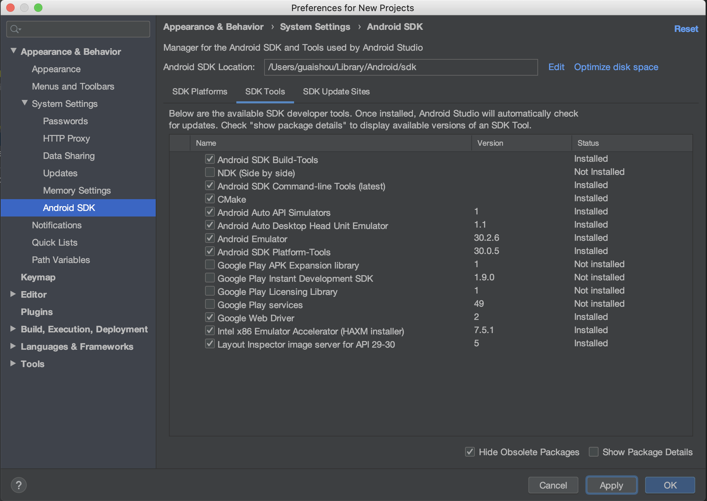
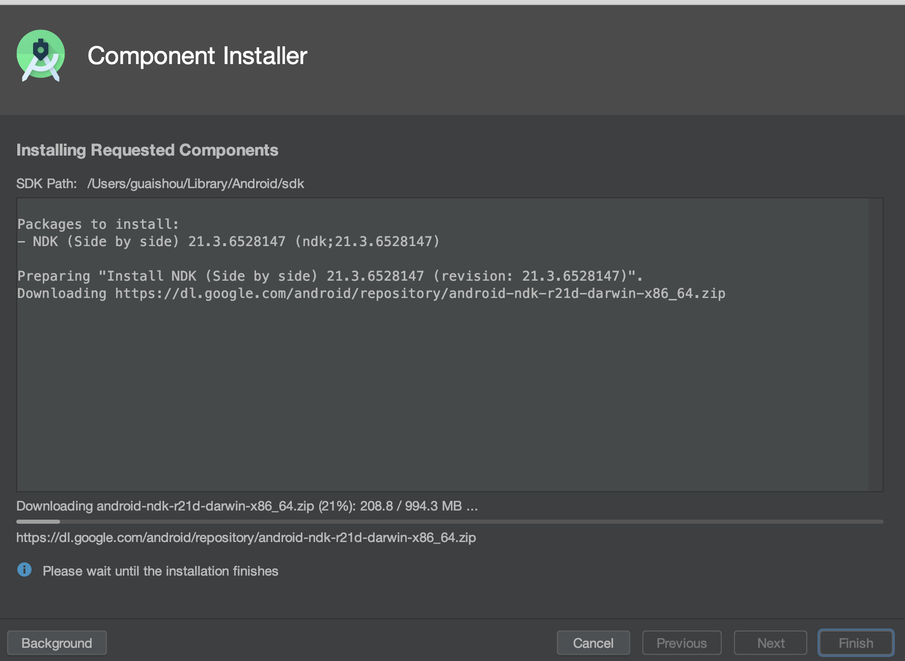

该工程是基于bilibili/ijkplayer 0.8.8, 改造成cmake构建, 这样方便调试与学习

bilibili/ijkplayer工程地址:https://github.com/bilibili/ijkplayer

最近有人反应不能成功Build，我跟进了一下，基本都是NDK环境的问题，如果没有安装NDK,在Gradle 同步的就会自动去下载，如果网上慢会需要很久。这个库有994.3M，我试了一下即使不翻墙，下载速度也很快，请按照如下的步骤先安装NDK（我试了好几种方式图都容易挂，如果图挂了就把工程下载下来）：

